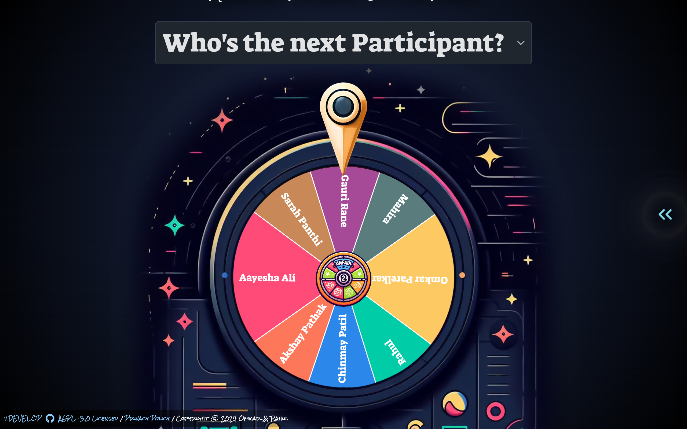
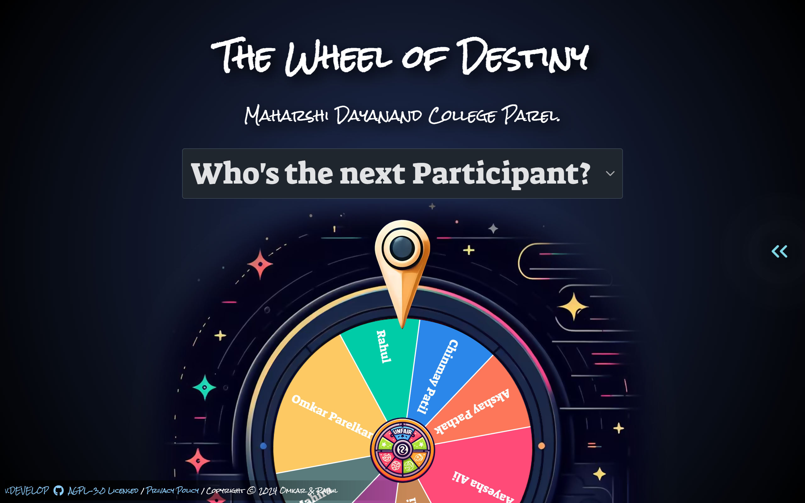

# The Wheel of Destiny
<u><h3>The Wheel of Destiny </u> is an engaging and fun web based application designed for the orientation of</h3> <h2><b>"MD College."</b></h2>
 
<h3>It allows users to edit the names of <i>FY students</i> and <u>spin a virtual wheel</u> to determine their fate in various fun activities.
</h3>
  

 

## Features
<h3>
 - Editable Names: Easily edit and customize the names of FY students to fit the event.
- Interactive Wheel: Spin the wheel to randomly select students for various activities.
- User-Friendly Interface: Simple and intuitive design for ease of use. </h3>

## Limitations
<h3>
- No Sound Effects: The current version does not include sound effects.
- No OBS Mode Support: OBS mode is not supported in this version.
</h3>
 
 

 
 

## Contributions
<h3>
 Team which had Contributed:- 
1) Backend(JS Frameworks💀):_ Rahul, Omkar, Chinmay 
2)Frontend:- Gauri 
<strike>UI/UX Designer</strike> 
3)QA Tester:- ALl Rest :) 
  
Contributions are welcome! If you have suggestions for improvements or new features, please feel free to submit a pull request. For major changes, please open an issue first to discuss what you would like to change.</h3>

## License

<h3>
This project is licensed under the MIT License. See the LICENSE file for more details.</h3>

## Acknowledgements
<h3>
- The Wheel of Destiny was inspired by various online spinning wheel games.

- This project is based on an existing open-source project. 
- I have added my own features and modifications to enhance its functionality and usability.</h3>

## Contact

- For any questions or feedback, please contact <a href="mailto:omkarparelkar2006@gmail.com">Omkar</a>

